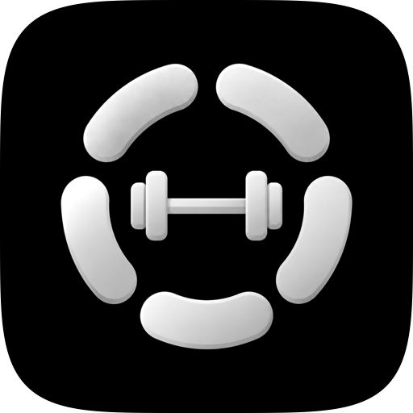

# &nbsp;&nbsp;Gym Nutshell

App de check-in diário de metas fitness, com conquistas, temas e bônus de sequência para transformar a rotina de treino e alimentação em um jogo.

Este repositório apresenta o projeto. O código de cada plataforma fica no seu próprio repositório, listado abaixo.

## Baixar

- **iPhone, iPad, Apple Watch e Mac:** [App Store](https://apps.apple.com/us/app/gym-nutshell/id6774739305)
- **Android e Wear OS:** [GymNutshell-1.0.apk](https://jonathasmotta.com/downloads/GymNutshell-1.0.apk), para instalação direta no aparelho

## Repositórios

| Plataforma | Repositório | Tecnologia |
|---|---|---|
| iOS, iPadOS, watchOS e macOS | [gymnutshell-ios](https://github.com/jonathaxs/gymnutshell-ios) | Swift, SwiftUI e SwiftData |
| Android e Wear OS | [gymnutshell-android](https://github.com/jonathaxs/gymnutshell-android) | Kotlin, Jetpack Compose e Room |

As duas versões são nativas e têm as mesmas funções. O backup em JSON é compatível entre elas, então dá para levar os dados de uma plataforma para a outra.

## O que o app faz

- **Metas do dia:** musculação, cardio, sono, água, calorias, proteína, carboidrato, gordura boa, fibra e creatina, além de metas personalizadas.
- **Metas calculadas para você:** valores recomendados a partir do peso, altura, idade, sexo e objetivo.
- **Conquistas:** o progresso médio do dia vira um de quatro níveis, mostrado com o emoji de um dos 19 temas, e fica registrado em um calendário.
- **Bônus de sequência:** semanas e meses completos nos níveis mais altos rendem pontos extras.
- **No relógio:** app próprio no Apple Watch e no Wear OS, sincronizado com o celular.
- **Widgets** de progresso, calendário e metas.
- **Integração com a saúde:** lê os treinos e registra o sono, pelo Apple Saúde ou pelo Health Connect.
- **Lembretes** por meta, com intervalo configurável.
- **Português do Brasil e English**, com suporte a VoiceOver e TalkBack.

## Mesmo app, duas arquiteturas

| | iOS | Android |
|---|---|---|
| Interface | SwiftUI | Jetpack Compose com Material 3 |
| Padrão | MV, com o estado nas views | MVVM, com ViewModel e StateFlow |
| Módulo compartilhado | Swift Package `GymNutshellCore` | Módulo Gradle `:core` |
| Persistência | SwiftData e UserDefaults | Room e DataStore |
| Saúde | HealthKit | Health Connect |
| Relógio | WatchConnectivity | Wear Data Layer e Tile |
| Widgets | WidgetKit | Glance |
| Lembretes | UserNotifications | WorkManager |

Cada versão segue o jeito recomendado da sua plataforma, em vez de forçar um padrão único.

## Privacidade

Sem cadastro, sem servidores, sem análise de uso e sem anúncios. Os dados ficam no aparelho do usuário. Veja a [política de privacidade](https://jonathasmotta.com/gymnutshell/privacy).

## Autor

Desenvolvido por **Jonathas Motta** ([@jonathaxs](https://github.com/jonathaxs)). Mais projetos em [jonathasmotta.com](https://jonathasmotta.com).
